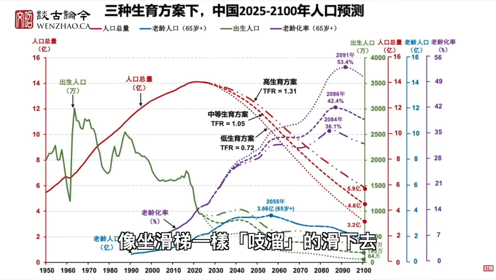

By 2100, china population will decline by 100M which is the total of Europe 700M + US 350M 
视频内容主要围绕中国人口未来可能减少至 4 亿的预测，探讨其背后的原因及未来可能经历的社会变迁

# Summary

1. 资产负债表衰退   [Balance Sheet Recession](Balance%20Sheet%20Recession.md)
 2. 30M housing supply but only 4M consumers
 3. Highly industrialised AI supply chain, production x10 but no consumers (robot only produce but does not consume -> deadlock to economy) 
 4. Pension/CPF - 
	 - 2000: 5 working adult : 1 old folk
	 - 2025 3 working adult : 1 old folk
	 - 2100: 1 working adult : 1.3 old folk.	 
5.  Highly deserted city: no maintenance to infrastructure
6. High human cost - plumber, eletrician, care giver

https://www.youtube.com/watch?v=e9RD0qSWXvY
