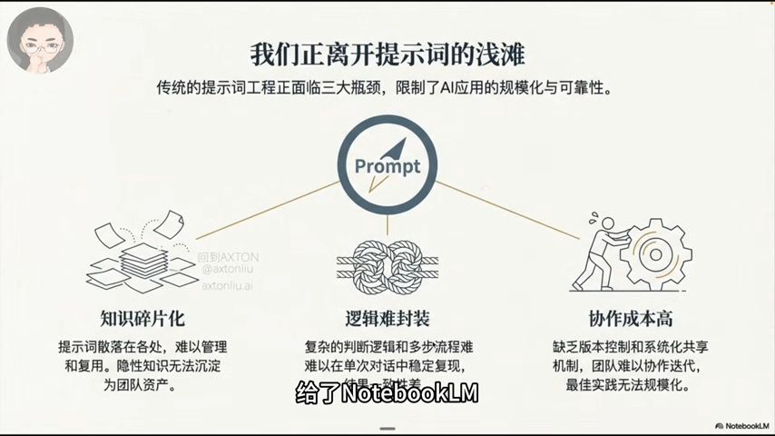
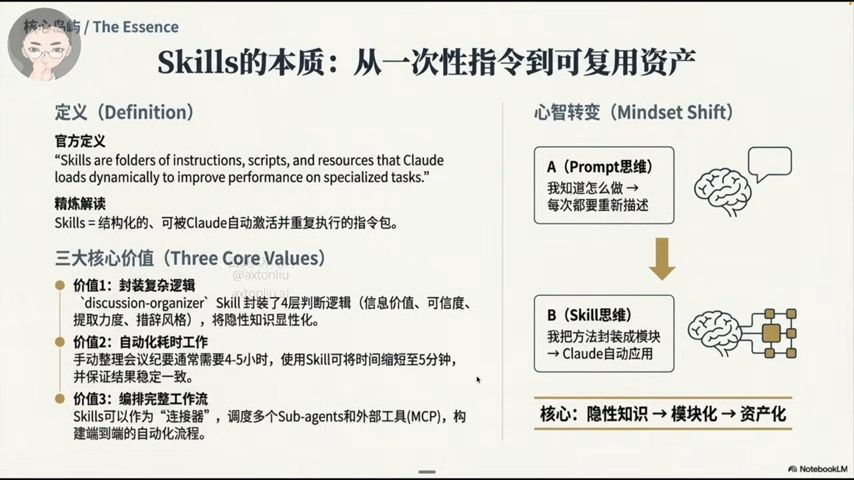
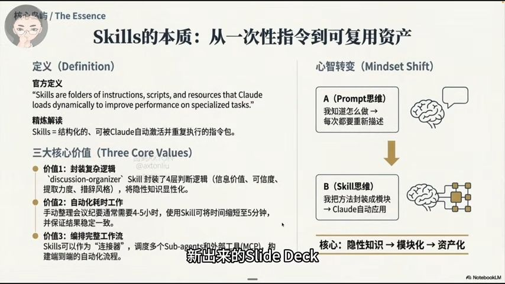
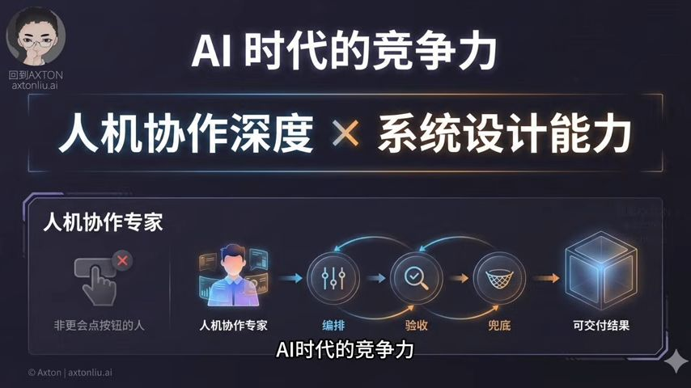

## Summary
- 频围绕 AI 时代的内容质量与信任、系统重要性及个人应对策略展开。指出 2025 年年度词 “Slop” 代表 AI 生成的低质量内容，当内容生成廉价，信任变得昂贵。回顾 2020 年对 AI 的思考，提出 AI 时代竞争力公式，强调人机协作专家角色。以 Taco Bell 点餐系统为例说明系统重要性，用 MAPS 四维罗盘阐释造系统方法，并通过实例强调系统比工具重要，认为未来被淘汰的是仅凭基础技能工作的人，建议选真实任务、拆分模块并多次实践来打造系统能力。

## Key Points
- Post GPT, we are getting too much AI generated information (as cheap as tap water) and we capture it, store it and deliver it and use it decision making. How we know the information is reliable?
	- Generation turns cheap, Trust turns expensive
-  [00:58](https://www.youtube.com/watch?v=9J_o779xb5k&t=58#t=00:58.12) 

- For USD 320, Axton bought the world top intelligence + ChatGPT pro+Claude Max Plan + Gemini Pro
-  [03:42](https://www.youtube.com/watch?v=9J_o779xb5k&t=222#t=03:42.50) 
- MAPS - Mindset x Architecture x Prompt x Systems 
	-To make sure the output is stable / constantly good (swapping model, result is the same). need to have guard rails, exception handling
-
-Prompt Challenge  [08:24](https://www.youtube.com/watch?v=9J_o779xb5k&t=504#t=08:24.26) 

-  [08:26](https://www.youtube.com/watch?v=9J_o779xb5k&t=506#t=08:26.42) 

- Claude Skill (versioning-able prompts) [08:25](https://www.youtube.com/watch?v=9J_o779xb5k&t=506#t=08:25.89) 

## Notable Quotes
> 嘿,你好,欢迎回到 Axton 2025年的年度词不是AGI,不是Agent,也不是未来以来 而是一个很恶心的词,叫 Slop Slop 本来是泔水的意思 在AI时代,它指的就是AI批量生成的低质量的内容 你有没有发现,这一年你最大的焦虑可能已经不是没有内容了 而是内容太多了 多到你越来越不敢信 你刷到的,搜到的,看到的,越来越像一锅粥 看着像知识,闻着像干货 但是你并不确定它到底靠不靠谱 所以我想问你一个更现实的问题 当内容就像自来水一样 一开水龙头就哗哗地流出来的时候 谁来负责它的可信度呢 你可以不信它 但是你每天都在用它来做决定 你会把它发出去交付给别人 你还会把它存起来当作你自己的资料 你还可能会在下一次工作当中去复用它 那问题是,如果它错了 代价是谁来承担呢 这个问题其实就是AI时代的一个新的矛盾 当生成变得廉价的时候 信任就会变得昂贵 这并不是简单的哪一个模型更强的问题 也不是我今天才开始想的 其实我在2020年就开始想了 那个时候我刚开始做YouTube 我录了一期视频 题目叫做 病毒与人工智能谁会造成更惨烈的失业潮 当时我埋下了一个 未来会越来越痛 的预告 埋下了一个未来我自己会回来验收的判断 那今天呢 我就来验收了 2020年那期视频 我开头就问了一个问题 今天回头看演出已经正式开始了 我当时把它拆成了两种痛 病毒是短痛 而AI才是长痛 更关键的是啊 我不是在讲某一个工具 我是在讲一个更底层的趋势 过去机器主要是和人类来竞争身体的能力 而人类呢 靠认知能力还保持着优势 但是人工智能正在越来越多的认知技能上超越人类 甚至开始理解人类的情绪 那期视频里啊 我还讲了信息不是知识 而再往后走 人类最重要的也许并不是获得智慧 而是一次又一次的重塑自己 当时呢 我用了AlphaZero的例子 最后我说了一句话呀 当时听起来像是哲学 今天我终于能来验收这句话了 因为今天智能正在成为 大众化的商品 我每个月付出了三百二十美元 就能买到世界顶级的智能 AI正在让看起来很有智慧 变得太容易 太便宜 那么决定胜负的是什么呢 我认为决定胜负的 不是你能不能生成 而是你能不能 把生成的东西变成可靠的交付 为此我总结给我一句话 AI时代的竞争力 等于人机协作深度 乘以系统设计能力 我在2025年初 在吴晓波频道的直播里 还提到过一个 我认为很有潜力的角色 人机协作专家 他不是一个更会点按钮的人 而是能把AI变成 可交付结果的那种人 他们的核心工作不是生成 而是编排 验收和兜底 说白了就一件事 生成这一步 正在变成零门槛 我有一句 自己反复验证过的判断 AI的核心价值 就在于 把高价值脑力活动的边际成本 压到接近于零 以前写一篇像样的文章 要一天 而现在两分钟 能出十篇 以前整理一份研究 可能要几小时 而现在一键总结 以前做一个初稿要熬夜 现在可以自动生成 于是生成变得不稀缺 甚至廉价泛滥 Slop 就是它最好的 副作用 所以真正会变贵的 不是生成 而是验证与交付 这将是2026年之后的分水岭 你可能会说 Axton 你是不是太谨慎了 现在模型这么强 怎么会翻车呢 那我跟你讲 翻车太正常了 而且翻的往往不是模型 是系统 你看一个例子就懂了 前一阵 Taco Bell的AI点餐 有人下了一个 离谱到不可能的订单 一万八千杯水 那系统居然 没有立刻识别到 这是一种 一个荒谬的订单 没有马上拦住 最后不得不转人工 那这些并不是AI不聪明 而是工程不及格 没有护栏 没有验收 没有兜底 那智能再便宜 没有系统 它就只是在加速的制造事故 好 现在我们讲什么是系统 我先用一句话来定义系统 系统就是一套 能够持续产出 可靠结果的流程 它包含护栏 验收和复盘 而且不绑定任何的工具 那判断一个东西 是不是系统 一个人是不是在教你系统思维 你不用听他的名字 你只要用三个问题来验证就够了 第一 它能不能复现 不是跑一次成功就算数 而是要跑十次都能稳定 第二 它出错能不能定位和兜底 如果错了 你能不能知道错在哪一步 能不能在系统里头把它兜住 不让它变成事故呢 第三 它换工具 换了模型 还能不能继续跑 如果你换一个模型 它就崩了 那这个不是系统 它只是一个工具的技巧堆而已 所以你可以把系统理解成四个组件 输入的契约 验收的标准 兜底的机制和资产沉淀 所以输入的时候你不要喂它垃圾 而验收的时候呢 不能靠感觉 至于兜底 你要默认它会出错 沉淀是为了让它可以复用 所以我们要记住啊 系统的目的 它不是生成更多 而是稳定交付 那怎么造系统呢 这就是我做MAPS的原因了 MAPS是一个 MAPS它不是一个知识点的合集啊 它是一张造系统的蓝图 它有四个维度 所以MAPS的全称是MAPS四维罗盘 你可以把它当做四个问题 你到底要做什么 你把它怎么去拆解 你跟机器怎么去签合同 你怎么把它来跑成闭环 如果没有Mindset 你就会被AI会替我搞定 这样的幻觉呢 带着跑偏 你会 vibe coding 你会被AI会替我搞定 是的 一天做十来个Demo 看起来很热闹 但是你根本没有想清楚 要交付什么 怎么验收 错了谁负责 最后不是交付不了 就是把技术债给加速成事故 如果Architecture没有 你就永远定位不到 问题出在了哪一步 你只能整段的去推倒重来 返工也能把你拖死 而Prompt 如果你不把它当做合同来严肃的对待 那么你每次交付都是像在抽奖 今天AI很懂你 明天AI就变傻了 你没法验收 只能背锅 那System系统如果没有闭环呢 你就只能跑通一次Demo 第二次可能就崩了 最后你还会回到手工 那你积累的就不是资产 只是一次性的劳动而已 到这里你应该就明白了 MAPS它不是四个概念 它是四个动作 你不是在理解它 你是在用它 我给你看一个我最近最满意 也最能说明 系统为什么比工具重要的例子吧 我把自己接近三万字的 Claude Skills 的笔记喂 给了NotebookLM 新出来的Slide Deck 它几乎不需要设置 就一键生成了15页的PPT 最关键的 不是它帮我省了多少时间 而是它在表现层 尽量的尊重了我原来的架构 它没有给我堆一堆的酷炫的假图 而是真正的用图 来表达我的笔记里的结构 比如我在笔记里写的 字幕的处理四阶段的流水线 每一个阶段的中间文件 它都能画出来 让图变成我整个逻辑的一部分 那对我来说呢 这就叫Asset Fidelity 资产的Fidelity 资产保真度 AI帮你生成内容的时候 它能不能忠实的保留你原始资产的结构和逻辑 当然 我也不会把它当成永远保真的黑盒 它只是在表现层的 一个初稿的生成器而已 最后那层审核 永远都需要人来做 这里面真正值钱的并不是 我会用NotebookLM这个事 而是我前面的那套系统 我先把原始的资产写清楚 结构搭好 逻辑打磨好 然后再用工具把它 快速的表现出来 那工具会变 但是系统不会变 我再给你看一个更生产线的例子 十几秒就可以了 一个SRT字幕文件进来呢 我不会让AI一下子从头到尾 依次处理完成 我会把它拆成一个流水线 先分段 然后再审稿 然后再定稿 如果是英文内容呢 我们还可能会再一步翻译成中文 生成一个双语的文章 那每一步都有输出文件 你随时可以去查 错了你也知道 在哪里出的错 出了问题你还能回滚 还能重跑 这个同样的流程 我用 Make 来实现过 用OpenAI的Agent Builder 也实现过 用 Claude Agent Skills 都实现过 那我强调一下 这不是为了炫技啊 因为系统的核心 它不是Agent的数量 也不是工具有多新 而是每一步都可以验收 可以定位 可以复用 OK到这里 我们终于可以自然的谈一下 失业和淘汰了 而且我的目的 不是为了吓唬大家 那我的观点就是 AI已经深刻的改变了很多行业 但真正被淘汰的 并非某一个职业 而是仅凭基础技能吃饭的人 AI不会让所有的人立刻失业 但是它会持续的淘汰一种东西 那就是没有系统的工作方式 未来更值钱的 不是会用AI 而是能让AI可控 可验收 可交付 你可以把它理解成一种新的角色 你不是内容的生产者 你是一个结果的负责者 你不是写作者 你是验证者 你不是工具的用户 你是系统的建造者 我们可以把它叫做人机协作专家 他能编排 能验收 能兜底的这样一个人 这个变化很现实 也很残酷 但它并不是焦虑营销 它是一条可以用工程的方法 来应对的趋势 而系统化的能力呢 就是那一条路 讲到这里 我就可以很坦然的 说我的定位的边界了 那在黑五大促之后呢 有人就问我 Axton 啊 你的课能不能便宜一点 或者你来一个 出一个速成版的 我很理解这种想法 而且我完全知道 做一个99元的小白课 更容易火 更容易卖 更容易扩大销量 但我选择不走那条路 因为我真正擅长 也真正想交付的东西 不是某一个工具的操作步骤 而是造系统的能力 我并不想成为 这个时代最火的AI老师 我是想成为 那一批认真做事的人 在需要搭系统 需要把AI跑稳的时候 第一个想到的人 我服务的人也很明确 你愿意做练习 愿意复盘 愿意把输出 做到可追溯 可验收 可复用 你要的是长期的竞争力 而不是一时的爽 对这样的人来说 不再追工具 而是造系统 这不是口号 这是一条很具体的路线 如果你想从今天 开始走这条路 我给你三个 非常实际的动作 第一 选一个真实的任务 写清楚验收标准 第二 把任务拆成 可质检的模块 把输入输出 校验 兜底都写清楚 第三 跑十次直到稳定 记住啊 系统的能力 不是靠听懂建立的 而是要靠动手练出来的 2020年的时候 我说 获得智慧 仅仅只是一个起点 今天我再补一句 智慧让你看见方向 系统让你稳定的抵达结果 这就是我的新年宣言 不再追工具 开始造系统 如果你想把这条路 走得更快更稳 我的MAPS 就是完整的路线 新年快乐咱们系统里见

## Personal Insight
1. Key is to have the ability to differentiate/identify ==knowledge from information==
	- (Gathering) Data ->Information (linked)
	- (Creation) Knowledge (organised )-> Wisdom (applied)
2. Key: ==Ability to DELIVER== (not to generate content)

-  [04:02](https://www.youtube.com/watch?v=9J_o779xb5k&t=243#t=04:02.51) 

## Follow-ups
- [ ] 
