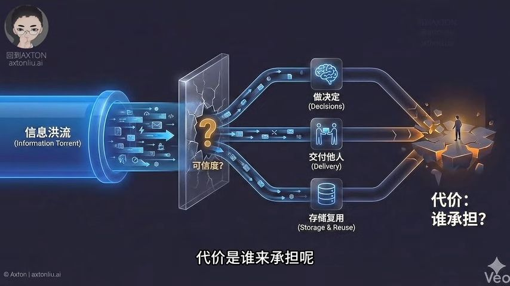

## Summary
- 频围绕 AI 时代的内容质量与信任、系统重要性及个人应对策略展开。指出 2025 年年度词 “Slop” 代表 AI 生成的低质量内容，当内容生成廉价，信任变得昂贵。回顾 2020 年对 AI 的思考，提出 AI 时代竞争力公式，强调人机协作专家角色。以 Taco Bell 点餐系统为例说明系统重要性，用 MAPS 四维罗盘阐释造系统方法，并通过实例强调系统比工具重要，认为未来被淘汰的是仅凭基础技能工作的人，建议选真实任务、拆分模块并多次实践来打造系统能力。

## Key Points
- Post GPT, we are getting too much AI generated information (as cheap as tap water) and we capture it, store it and deliver it and use it decision making. How we know the information is reliable?
	- Generation turns cheap, Trust turns expensive
-  [00:58](https://www.youtube.com/watch?v=9J_o779xb5k&t=58#t=00:58.12) 

## Notable Quotes
> 

## Personal Insight
- Key is to have the ability to differentiate/identify ==knowledge from information==
	- (Gathering) Data ->Information (linked)
	- (Creation) Knowledge (organised )-> Wisdom (applied)

## Follow-ups
- [ ] 
