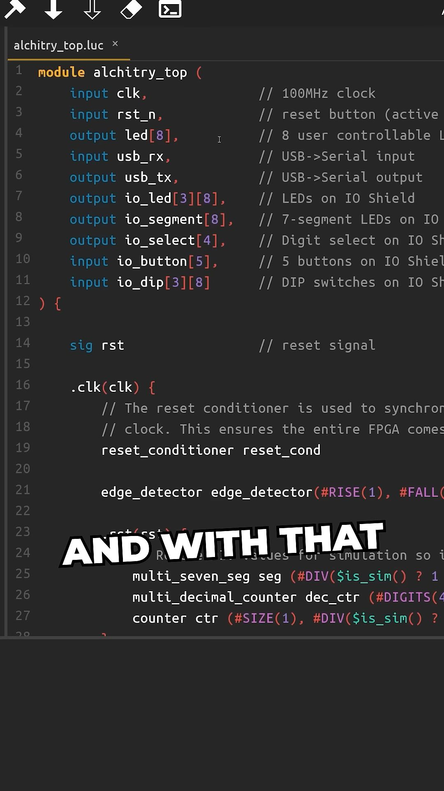

# Field Programmable Gate Array

## Programmable hardware
- write code (hardware description, not programming language)
- 
-  [00:20](https://www.youtube.com/watch?v=PLOT2FwtZu0&t=21#t=00:20.90) 
- it is on RAM, can program over and over again
- 
